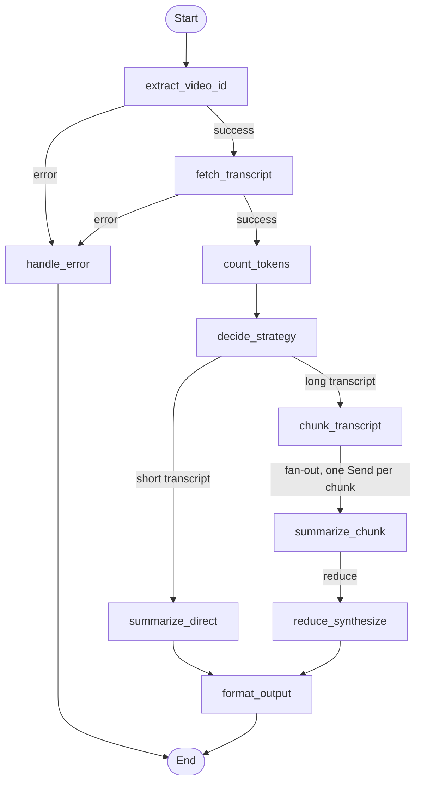

# 🎓 YouTube Lesson Agent

Turn any YouTube video into a structured, readable lesson — no watching required.

Paste a link, and the agent fetches the transcript, figures out the best way to process it based on length, and generates a clean lesson with key concepts, examples, a summary, and an optional quiz — every claim linked back to the exact timestamp in the video it came from.

Built with **LangGraph** to explore agentic, graph-based orchestration instead of a single linear prompt chain.

---

## ✨ Features

- **Any video length** — short videos are summarized directly; long ones are automatically chunked and processed with a map-reduce strategy so nothing gets lost to context limits.
- **Source-linked concepts** — every key concept and example cites the timestamp it was taught at, rendered as a clickable link straight to that moment in the video.
- **Adjustable difficulty** — generate the same lesson at Beginner, Intermediate, or Advanced depth.
- **Optional examples & quiz** — toggle whether the lesson includes extracted examples/case studies and a self-test quiz.
- **Structured, not freeform** — every LLM call returns a typed Pydantic schema (not raw text you have to hope is well-formatted), so output is consistent across every run.
- **Transcript caching** — transcripts are cached by video ID in SQLite, so re-running on the same video skips the YouTube fetch entirely.
- **Resumable runs** — LangGraph's SQLite checkpointer persists graph state, so runs are resumable and inspectable by thread ID.
- **Streamlit UI** — live step-by-step progress as the agent moves through the graph, from transcript fetch to final formatting.

<!-- ---

## 🖼️ Demo

```
[ screenshot: sidebar settings + generated lesson with clickable timestamps ]
``` -->

---

## 🧠 How It Works

The entire pipeline is a LangGraph `StateGraph` — not a linear script. Each step is a node, with conditional edges routing execution based on the state at runtime.



**Why a graph instead of a linear chain?**

- **Conditional branching** — a 5-minute tutorial and a 3-hour lecture need different processing strategies. `decide_strategy` routes based on token count, not video duration (talk speed varies).
- **Map-reduce fan-out** — long transcripts are split into chunks and summarized in parallel using LangGraph's `Send` API, then reduced into one coherent lesson. This is the part a simple prompt chain can't do cleanly.
- **Error states as first-class nodes** — a missing transcript or a bad URL routes to a dedicated `handle_error` node rather than being caught ad hoc, so failure paths are visible directly in the graph structure.
- **Checkpointing** — every run is persisted by `thread_id`, so the graph's state at any point is inspectable and resumable, not just a black box.

---

## 🏗️ Architecture

```
app/
├── main.py          # CLI entry point (quick local testing)
├── app.py           # Streamlit UI — the primary entry point
├── graph.py          # Builds and compiles the LangGraph StateGraph
├── nodes.py          # All graph node functions
├── routers.py         # Conditional edge / routing logic (incl. Send fan-out)
├── state.py          # TypedDict schemas for graph state
├── schema.py          # Pydantic models for structured LLM output
├── llm.py           # OpenAI calls (direct summarize / chunk summarize / synthesize)
├── youtube.py         # Video ID extraction from any YouTube URL format
├── transcript.py       # Transcript fetching via youtube-transcript-api
├── chunking.py         # Token-aware transcript chunking for long videos
├── tokenizer.py        # Token counting via tiktoken
├── strategy.py         # Direct vs. chunked strategy decision
├── formatter.py        # Renders the structured lesson into Markdown
├── cache.py           # SQLite cache for fetched transcripts
└── db.py             # LangGraph SQLite checkpointer setup
```

**Design principle:** each file has one job. LLM logic, graph wiring, state definitions, and output formatting are fully decoupled — swapping the output format (say, HTML or PDF instead of Markdown) only touches `formatter.py`, not the graph itself.

---

## 🛠️ Tech Stack

| Layer | Choice | Why |
|---|---|---|
| Orchestration | [LangGraph](https://github.com/langchain-ai/langgraph) | Graph-based state machine — needed for conditional routing and parallel chunk fan-out, which a linear chain can't express cleanly |
| LLM | OpenAI API (`gpt-4o` for synthesis, `gpt-4o-mini` for chunk summarization) | Split by task cost — cheap model does the bulk extraction, strong model does final synthesis |
| Structured output | Pydantic + `client.responses.parse` | Typed, validated output instead of parsing freeform text |
| Transcript source | [`youtube-transcript-api`](https://github.com/jdepoix/youtube-transcript-api) | No YouTube API key required |
| Token counting | `tiktoken` | Accurate chunk sizing instead of naive character counts |
| Persistence | SQLite (`langgraph-checkpoint-sqlite`) | Graph state checkpointing + transcript caching |
| UI | Streamlit | Fast to build, good fit for a single-workflow tool |

---

## 🚀 Getting Started

### Prerequisites
- Python 3.10+
- An [OpenAI API key](https://platform.openai.com/api-keys)

### Installation

```bash
git clone https://github.com/guptanuj890/YT_Summarizer.git
cd YT_Summarizer

python -m venv venv
source venv/bin/activate   # Windows: venv\Scripts\activate

pip install -r requirements.txt
```

### Configuration

Create a `.env` file in the project root:

```
OPENAI_API_KEY=your-api-key-here
```

### Run the app

```bash
cd app
streamlit run app.py
```

Then open the local URL Streamlit prints (usually `http://localhost:8501`), paste a YouTube URL, choose your lesson settings in the sidebar, and click **Generate Lesson**.

### Run from the CLI

```bash
cd app
python main.py
```

---

## ⚙️ Configuration Options

| Setting | Options | Effect |
|---|---|---|
| Difficulty | Beginner / Intermediate / Advanced | Changes explanation depth and assumed prior knowledge |
| Include Examples | On / Off | Extracts case studies and demonstrations mentioned in the video |
| Include Quiz | On / Off | Generates self-test questions from the video's content |

`DIRECT_TOKEN_LIMIT` in `strategy.py` (default `6000`) controls the cutoff between direct summarization and the chunked map-reduce path — adjust if you want finer control over cost vs. quality for medium-length videos.

---

## 🗺️ Roadmap

- [ ] Cache final generated lessons (not just transcripts) keyed by video ID + settings, to avoid re-paying for identical requests
- [ ] Support additional URL formats (`/embed/`, `/live/`)
- [ ] Non-English transcript translation before processing
- [ ] Human-in-the-loop review step before final formatting (via LangGraph's `interrupt`)
- [ ] Export lessons as PDF/Notion in addition to Markdown
- [ ] LangSmith tracing for per-node latency and token usage visibility

---

## 🙋 Why I Built This

*("I wanted a hands-on project to learn LangGraph's state management and conditional routing beyond simple linear chains, while solving a problem I actually run into: long tutorial videos where I miss some of the details due to lack of focus, It can also be used as notes generator for a video")*
