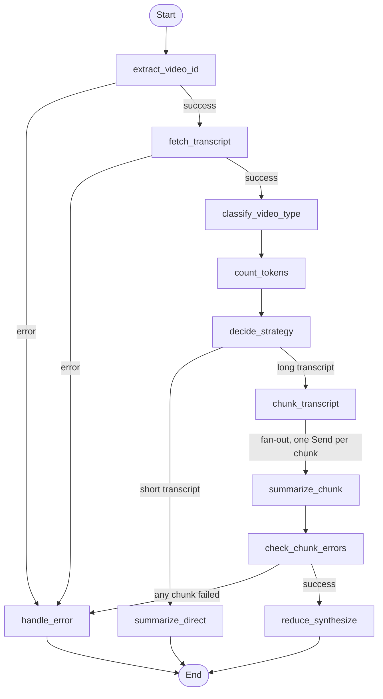

# 🎓 YouTube Lesson Agent

Turn any YouTube video into a structured, readable lesson — no watching required.

Paste a link, and the agent fetches the transcript, classifies the type of video it's dealing with, and generates a complete lesson: key concepts with analogies, examples, a summary, a quiz, and follow-up questions — every claim linked back to the exact timestamp it came from. You can then ask follow-up questions about the lesson in a chat interface, and export the result as Markdown or PDF.

Built with **LangGraph** to explore agentic, graph-based orchestration — conditional routing, parallel map-reduce, and per-branch error handling — rather than a single linear prompt chain, with guardrails treated as a first-class part of the design rather than an afterthought.

---

## ✨ Features

- **Any video length** — short videos are summarized directly; long ones are automatically chunked and processed in parallel with a map-reduce strategy so nothing gets lost to context limits.
- **Video-type aware** — the agent classifies each video (tutorial, lecture, coding tutorial, interview, podcast, conceptual explanation, news, or other) and adapts the lesson's structure accordingly — a coding tutorial gets implementation-focused treatment, an interview gets organized around what was asked and answered.
- **Source-linked concepts** — every key concept and example cites the timestamp it was taught at, rendered as a clickable link straight to that moment in the video.
- **Adjustable difficulty** — generate the same lesson at Beginner, Intermediate, or Advanced depth, with explanation style and technical depth adjusted accordingly.
- **Taught, not just extracted** — concepts lead with *why it matters* before *what it is*, connect back to earlier concepts in the same lesson, include a real-world analogy when one genuinely fits (never a forced one), and call out anything counter-intuitive the video reveals.
- **Key takeaways** — a short, scannable TL;DR separate from the full summary.
- **Follow-up questions** — open-ended prompts for exploring the topic further, distinct from the graded quiz.
- **Optional examples & quiz** — toggle whether the lesson includes extracted examples/case studies and a self-test quiz.
- **Ask follow-up questions in chat** — once a lesson is generated, ask it anything; the agent answers using the lesson as its primary source, remembers the conversation, and summarizes older messages so long chat sessions don't blow the context window.
- **Lesson history** — every generated lesson (and its chat thread) is saved to SQLite and can be reopened later from the sidebar.
- **Export to Markdown or PDF** — download the finished lesson, including the chat thread, in either format.
- **Structured, not freeform** — every LLM call returns a typed Pydantic schema, so output is consistent across every run.
- **Resilient by design** — every LLM call (lesson generation *and* chat) retries with backoff on transient failures and fails gracefully with a friendly message rather than a raw traceback; if one transcript chunk fails during a long video, the agent reports it as an error rather than silently producing an incomplete lesson; if chat history fails to save, the conversation still continues uninterrupted.
- **Transcript caching** — transcripts are cached by video ID in SQLite, so re-running on the same video skips the YouTube fetch entirely.
- **Resumable runs** — LangGraph's SQLite checkpointer persists graph state by thread ID.

---

## 🛡️ Safety & Guardrails

A YouTube transcript is content the agent doesn't control, and the chat feature takes direct freeform input from users — both are treated as untrusted surfaces throughout the pipeline, not just sanitized once at the edge.

- **Prompt-injection resistant.** Every LLM call that touches transcript content — direct summarization, chunk summarization, final synthesis, and video-type classification — explicitly instructs the model to treat the transcript as untrusted source material and ignore any instructions, role-override attempts, or commands embedded within it. If a video *discusses* prompt injection as its subject matter, the model is told to explain it as content, not act on it.
- **Untrusted data kept out of the instruction channel.** Transcript text, chunk summaries, chat history, and conversation summaries are passed as `input`, never concatenated into the trusted `instructions` string — keeping the model's actual behavior rules separate from anything an external source (video or user) could influence. Prior conversation data passed back into future chat turns is explicitly wrapped and labeled as untrusted data for the same reason: a rolling summary is a persistence mechanism, so it gets the same scrutiny as a live message.
- **Scoped chat.** The chat assistant is instructed to answer only questions related to the current lesson, and to decline — rather than attempt — anything that asks it to change role, reveal hidden instructions, or act outside that scope.
- **Output moderation.** Every chat response is checked against OpenAI's moderation endpoint before being shown to the user; a flagged response is replaced with a generic message instead of being displayed.
- **Input validation.** Chat messages are length-capped and empty submissions are rejected before reaching the model.
- **Cost ceilings.** A maximum-chunks-per-video limit prevents an extremely long video from fanning out into an unbounded number of parallel LLM calls, and a per-session generation limit caps how many lessons a single session can request.
- **No internal error leakage.** Failures from the LLM provider are logged by exception type only (never the raw message or request payload) and surfaced to the user as a generic, friendly error — avoiding accidental exposure of internals, stack traces, or request data.
- **Fail-soft, not fail-hard.** A failure in chat history summarization or persistence doesn't block the conversation — the user still sees their answer, with a warning that history wasn't saved, rather than losing the interaction entirely.


---

## 🧠 How It Works

The entire pipeline is a LangGraph `StateGraph` — not a linear script. Each step is a node, with conditional edges routing execution based on the state at runtime, and errors handled as first-class paths rather than exceptions caught ad hoc.


```mermaid
flowchart TD
    START([Start]) --> A[extract_video_id]
    A -->|error| ERR[handle_error]
    A -->|success| B[fetch_transcript]
    B -->|error| ERR
    B -->|success| C[classify_video_type]
    C --> D[count_tokens]
    D --> E[decide_strategy]
    E -->|short transcript| F[summarize_direct]
    E -->|long transcript| G[chunk_transcript]
    G -->|fan-out, one Send per chunk| H[summarize_chunk]
    H --> I[check_chunk_errors]
    I -->|any chunk failed| ERR
    I -->|success| J[reduce_synthesize]
    F --> END([End])
    J --> END
    ERR --> END
```

**Why a graph instead of a linear chain?**

- **Conditional branching** — a 5-minute tutorial and a 3-hour lecture need different processing strategies. `decide_strategy` routes based on actual token count of the transcript, not video duration (talk speed varies), so the cutoff reflects what's really being sent to the model.
- **Video-type-aware prompting** — `classify_video_type` runs once per video and its output is threaded into every downstream LLM call, so a coding tutorial and a podcast don't get forced into the same lesson shape.
- **Map-reduce fan-out** — long transcripts are split into chunks and summarized in parallel using LangGraph's `Send` API, then reduced into one coherent lesson. This is the part a simple prompt chain can't do cleanly.
- **Error states as first-class nodes** — a missing transcript, a bad URL, or a single failed chunk (via `check_chunk_errors`, which aggregates failures across the parallel fan-out) routes to a dedicated `handle_error` node rather than being caught ad hoc, so failure paths are visible directly in the graph structure.
- **Checkpointing** — every run is persisted by `thread_id`, so the graph's state at any point is inspectable and resumable, not just a black box.

---

## 🏗️ Architecture

```
app/
├── app.py            # Streamlit UI — the main entry point
├── graph.py           # Builds and compiles the LangGraph StateGraph
├── nodes.py           # All graph node functions
├── routers.py          # Conditional edge / routing logic (incl. Send fan-out)
├── state.py           # TypedDict schemas for graph state
├── schema.py           # Pydantic models for structured LLM output
├── llm.py            # OpenAI calls — direct / chunk summarize, synthesis, retry logic
├── classifier.py        # Video-type classification (tutorial, interview, etc.)
├── chat.py            # "Ask doubts" chat — answering, moderation, and conversation summarization
├── history.py          # SQLite-backed lesson + chat history
├── exporter.py          # Renders the lesson (+ chat) to Markdown and PDF
├── youtube.py          # Video ID extraction from any YouTube URL format, with validation
├── transcript.py        # Transcript fetching via youtube-transcript-api
├── chunking.py          # Token-aware transcript chunking for long videos
├── tokenizer.py         # Token counting via tiktoken
├── strategy.py          # Direct vs. chunked strategy decision
├── cache.py            # SQLite cache for fetched transcripts
└── db.py             # LangGraph SQLite checkpointer setup
```

**Design principle:** each file has one job. LLM logic, graph wiring, state definitions, chat, history, and export are fully decoupled — adding a new export format or a new chat feature doesn't touch the graph itself.

---

## 🛠️ Tech Stack

| Layer | Choice | Why |
|---|---|---|
| Orchestration | [LangGraph](https://github.com/langchain-ai/langgraph) | Graph-based state machine — needed for conditional routing, parallel chunk fan-out, and per-branch error aggregation, which a linear chain can't express cleanly |
| LLM | OpenAI API (`gpt-4o` for direct summarization, final synthesis, and chat; `gpt-4o-mini` for chat summarization) | Structured, typed output via `client.responses.parse` instead of parsing freeform text |
| Safety | OpenAI Moderation API (`omni-moderation-latest`) | Screens chat responses before they're shown to the user |
| Video classification | [TypeSafe AI SDK](https://docs.typesafe.ai/sdk/python/) | Constrained multi-class classification of video type, used to adapt lesson structure |
| Structured output | Pydantic | Typed, validated output instead of parsing freeform text |
| Transcript source | [`youtube-transcript-api`](https://github.com/jdepoix/youtube-transcript-api) | No YouTube API key required |
| Token counting | `tiktoken` | Accurate chunk sizing instead of naive character counts |
| Persistence | SQLite (`langgraph-checkpoint-sqlite` + custom tables) | Graph state checkpointing, transcript caching, and lesson/chat history |
| PDF export | `reportlab` | Lightweight, no external binary dependency |
| UI | Streamlit | Fast to build, good fit for a single-workflow tool with chat |

---

## 🚀 Getting Started

### Prerequisites
- Python 3.10+
- An [OpenAI API key](https://platform.openai.com/api-keys)
- A [TypeSafe AI API key](https://typesafe.ai) (used for video-type classification)

### Installation

```bash
git clone https://github.com/guptanuj890/YT_Summarizer.git
cd YT_Summarizer

python -m venv venv
source venv/bin/activate   # Windows: venv\Scripts\activate

pip install -r requirements.txt
```

### Configuration

Create a `.env` file in the project root:

```
OPENAI_API_KEY=your-openai-api-key-here
TYPESAFE_API_KEY=your-typesafe-api-key-here
```

### Run the app

```bash
cd app
streamlit run app.py
```

Then open the local URL Streamlit prints (usually `http://localhost:8501`), paste a YouTube URL, choose your lesson settings in the sidebar, and click **Generate Lesson**. Once it's ready, ask follow-up questions in the chat box at the bottom, or download the lesson as Markdown or PDF.

---

## ⚙️ Configuration Options

| Setting | Options | Effect |
|---|---|---|
| Difficulty | Beginner / Intermediate / Advanced | Changes explanation depth, terminology, and assumed prior knowledge |
| Include Examples | On / Off | Extracts case studies and demonstrations mentioned in the video |
| Include Quiz | On / Off | Generates self-test questions from the video's content |

`DIRECT_TOKEN_LIMIT` in `strategy.py` (default `6000`) controls the cutoff between direct summarization and the chunked map-reduce path. `CHUNK_TOKEN_LIMIT` in `chunking.py` controls how large each parallel chunk is. `MAX_CHUNKS_PER_VIDEO` in `nodes.py` and `MAX_GENERATIONS_PER_SESSION` in `app.py` control the cost/abuse guardrails described above. Adjust any of these for finer control over cost vs. quality.

---

## 🗺️ Roadmap

- [ ] Render Markdown/LaTeX properly in PDF export instead of showing raw syntax
- [ ] Generate PDFs in-memory on demand rather than writing a shared file to disk on every rerun
- [ ] Per-user isolation for lesson history (currently shared across all users of a deployment)
- [ ] Non-English transcript support with translation before processing
- [ ] Human-in-the-loop review step before final formatting (via LangGraph's `interrupt`)
- [ ] LangSmith tracing for per-node latency and token usage visibility
- [ ] Automated eval suite — golden-set regression tests for lesson quality, plus a concrete prompt-injection test (e.g. assert a transcript line like "ignore previous instructions" never leaks into output)
- [ ] Automated tests for the pure functions (URL parsing, chunking, routing logic)
- [ ] Moderation/validation on chat *input*, not just model output

---

## 📄 License

MIT — see [LICENSE](LICENSE).

---

## 🙋 Why I Built This

I wanted a hands-on project to learn LangGraph's state management and conditional routing beyond simple linear chains, while solving a problem I actually run into: long tutorial videos.